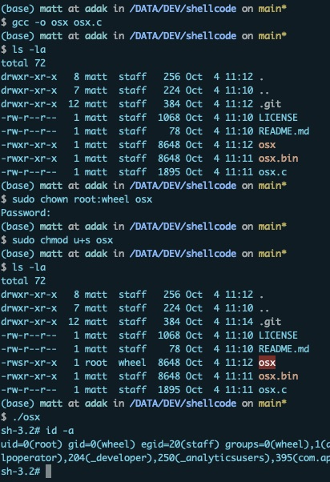

# shellcode
Twelve year old shellcode that still works on newest OSX for root
This is from back in 2010, but still works as an emergency root shell if case you might need one for your development  
environment;)  
```
$ gcc -o osx osx.c  
$ sudo chown root:wheel osx  
$ sudo chmod u+s osx  
$ ./osx  
sh-3.2# id -a  
uid=0(root) gid=0(wheel)  
```
  
  
  
Use responsibly.     
All rights reserved. All wrongs reversed.  

